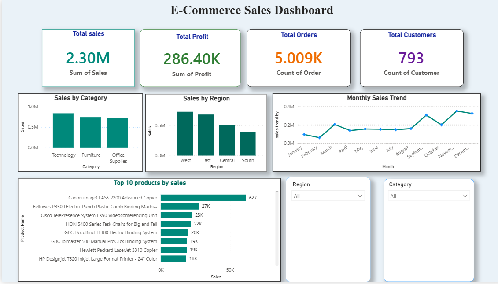

##  📊 E-Commerce Sales Analytics Dashboard

## 📌 Project Overview

This project analyzes an e-commerce sales dataset using **Python and Power BI**. The data was cleaned, explored, and visualized to identify key business insights such as total sales, profit, orders, customers, regional performance, category-wise sales, and top-performing products.

The Power BI dashboard provides an interactive way to monitor business performance and supports data-driven decision-making.

## 🚀 Features

* Data cleaning using Python
* Exploratory Data Analysis (EDA)
* KPI metrics:

  * Total Sales
  * Total Profit
  * Total Orders
  * Total Customers
* Sales by Category
* Sales by Region
* Monthly Sales Trend
* Top 10 Products by Sales
* Interactive slicers for Region and Category

## 🛠️ Technologies Used

* Python
* Pandas
* Matplotlib
* Power BI
* VS Code
* Git & GitHub

## 📂 Project Structure

```text
Ecommerce-Sales-Analytics/
│
├── data/
│   ├── raw/
│   │   └── SampleSuperstore.csv
│   └── cleaned/
│       └── cleaned_superstore.csv
│
├── python/
│   ├── data_cleaning.py
│   ├── eda.py
│   ├── analysis.py
│   └── visualization.py
│
├── power bi/
│   └── Ecommerce Sales Dashboard.pbix
│
├── Screenshots/
│   └── sales_dashboard.png
│
└── README.md
```

## 📊 Key Insights

* **Total Sales:** 2.30M
* **Total Profit:** 286.40K
* **Total Orders:** 5,009
* **Total Customers:** 793
* Technology generated the highest sales among the categories.
* The West region recorded the highest sales.
* Canon imageCLASS 2200 Advanced Copier was the top product by sales.

## 📷 Dashboard Preview



## ▶️ How to Run

### 1. Clone the repository

```bash
git clone https://github.com/Prasanna-oss-ai/Ecommerce-Sales-Analytics.git
```

### 2. Install required libraries

```bash
pip install pandas matplotlib
```

### 3. Run the Python files

```bash
python python/data_cleaning.py
python python/eda.py
python python/analysis.py
python python/visualization.py
```

### 4. Explore the dashboard

Open the Power BI `.pbix` file to explore the interactive dashboard.

## 🎯 Learning Outcomes

* Data Cleaning
* Data Analysis
* Data Visualization
* Dashboard Design
* Business Insights
* Git & GitHub Project Management

## 👨‍💻 Author

**Prasanna Gummalla**

* GitHub: [Prasanna-oss-ai](https://github.com/Prasanna-oss-ai)
* LinkedIn: [Prasanna Gummalla](https://www.linkedin.com/in/gummalla-prasanna-285352333)

---

⭐ Thank you for visiting the repository!
